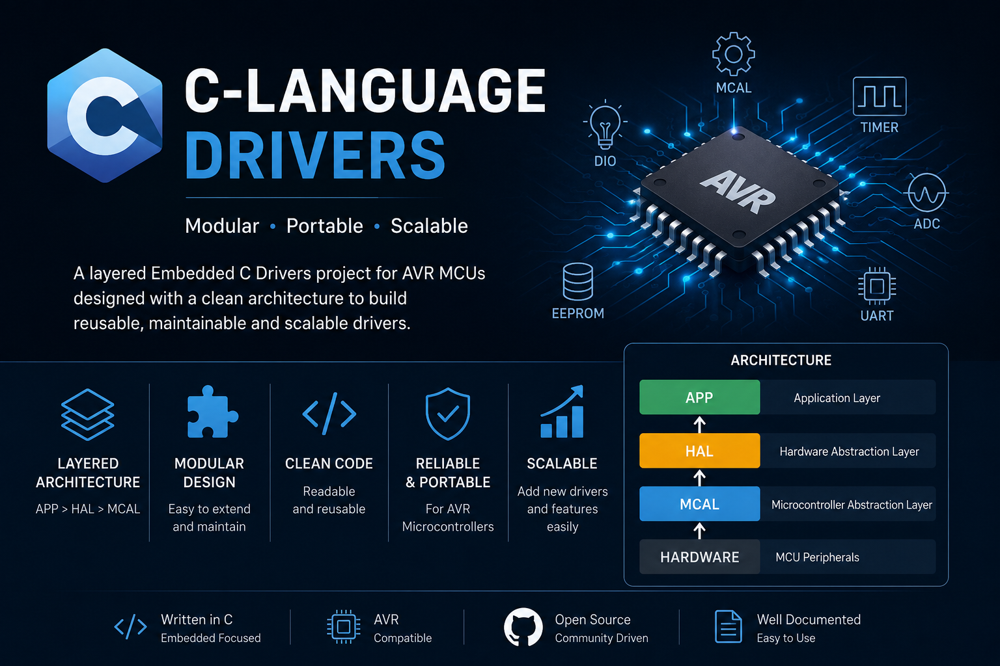

# C-Language-Drivers



A layered Embedded C Drivers project designed for AVR microcontrollers following a modular architecture (MCAL / HAL / APP).

The project aims to provide reusable, portable, and organized drivers that can be easily extended for future peripherals and applications.

---

## Project Structure

```
C-Language-Drivers/
│
├── APP/
│   ├── main.c
│   ├── APP.c
│   └── APP.h
│
├── HAL/
│   ├── LED/
│   │   ├── LED_config.h
│   │   ├── LED_int.h
│   │   ├── LED_private.h
│   │   └── LED_prog.c
│   │
│   ├── BUTTON/
│   │   ├── BUTTON_config.h
│   │   ├── BUTTON_int.h
│   │   ├── BUTTON_private.h
│   │   └── BUTTON_prog.c
│   │
│   ├── LCD/
│   │   ├── LCD_config.h
│   │   ├── LCD_int.h
│   │   ├── LCD_private.h
│   │   └── LCD_prog.c
│   │
│   ├── KEYPAD/
│   └── SEVEN_SEGMENT/
│
├── MCAL/
│   ├── 1-DIO/
│   │   ├── DIO_config.h
│   │   ├── DIO_int.h
│   │   ├── DIO_private.h
│   │   └── DIO_prog.c
│   │
│   ├── 2-EXTI/
│   ├── 3-TIMER/
│   ├── 4-ADC/
│   ├── 5-UART/
│   ├── 6-SPI/
│   ├── 7-I2C/
│   ├── 8-WDT/
│   ├── 9-EEPROM/
│   └── 10-GPIO/
│
├── STD-LIB/
│   ├── Bit_Math.h
│   └── Std_Types.h
│
├── LIB/
│   ├── Error_State.h
│   └── Common_Macros.h
│
├── Documentation/
│   ├── Images/
│   ├── Datasheets/
│   └── Diagrams/
│
├── Examples/
│   ├── LED_Blink/
│   ├── Button_LED/
│   └── LCD_HelloWorld/
│
├── Proteus/
│   └── Simulations/
│
├── .gitignore
├── README.md
└── LICENSE
```

---

# Layers

## APP

Contains the application logic.

The APP layer communicates only with the HAL layer.

Example:

- Main program
- Project-specific logic

---

## HAL (Hardware Abstraction Layer)

Contains high-level drivers that use MCAL drivers.

Examples:

- LED
- Button
- LCD
- Keypad
- Seven Segment
- Buzzer
- Relay
- Servo
- DC Motor
- Stepper Motor

---

## MCAL (Microcontroller Abstraction Layer)

Contains low-level drivers that directly access the AVR registers.

Current Driver:

- DIO

Future Drivers:

- EXTI
- TIMER
- ADC
- UART
- SPI
- I2C (TWI)
- WDT
- EEPROM
- PWM
- ICU

---

## STD-LIB

Common reusable headers.

### Bit_Math.h

Contains macros for bit manipulation.

Example:

```c
SET_BIT(REG,BIT);
CLR_BIT(REG,BIT);
TOG_BIT(REG,BIT);
GET_BIT(REG,BIT);
```

---

### Std_Types.h

Contains standard data types.

Example:

```c
u8
u16
u32
s8
s16
s32
f32
f64
```

---

## LIB

Common helper headers shared by all drivers.

Example:

- Error state definitions
- Common macros
- Compiler attributes

---

## Documentation

Project documentation.

Can include:

- Datasheets
- Images
- Architecture diagrams
- Driver flowcharts

---

## Examples

Ready-to-run example projects demonstrating driver usage.

Examples:

- LED Blink
- Push Button
- LCD
- ADC Reading
- UART Echo

---

## Proteus

Simulation files.

Example:

- `.pdsprj`
- `.dsn`

---

# Driver File Description

Each driver follows the same structure.

### config

Contains configurable options.

Example:

```c
DIO_config.h
```

---

### interface

Public APIs used by other modules.

Example:

```c
DIO_int.h
```

---

### private

Private definitions.

Example:

```c
DIO_private.h
```

---

### program

Implementation of the driver.

Example:

```c
DIO_prog.c
```

---

# Naming Convention

| File | Purpose |
|-------|---------|
| *_config.h | User Configuration |
| *_int.h | Public Interface |
| *_private.h | Private Definitions |
| *_prog.c | Driver Implementation |

---

# Coding Rules

- Modular Design
- Layered Architecture
- No direct register access outside MCAL
- Reusable Drivers
- Readable Code
- Portable Design

---

# Current Drivers

| Driver | Status |
|---------|--------|
| DIO | ✅ Completed |

---

# Planned Drivers

| Driver | Status |
|---------|--------|
| EXTI | ⏳ Planned |
| TIMER | ⏳ Planned |
| ADC | ⏳ Planned |
| UART | ⏳ Planned |
| SPI | ⏳ Planned |
| I2C | ⏳ Planned |
| EEPROM | ⏳ Planned |
| PWM | ⏳ Planned |
| WDT | ⏳ Planned |

---

# Author
Anas

Embedded Systems Driver Library

Designed for learning Embedded C and AVR Microcontrollers.

---

# License

This project is released under the MIT License.
